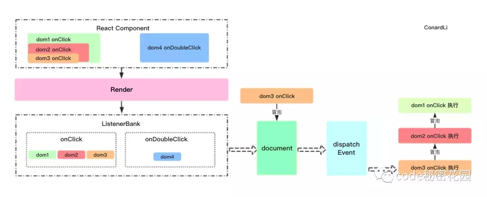

#### React如何实现自己的事件机制？
React合成事件一套机制：React并不是将click事件直接绑定在dom上面，而是采用事件冒泡的形式冒泡到document上面，然后React将事件封装给正式的函数处理运行和处理。

React合成事件理解
如果DOM上绑定了过多的事件处理函数，整个页面响应以及内存占用可能都会受到影响。React为了避免这类DOM事件滥用，同时屏蔽底层不同浏览器之间的事件系统差异，实现了一个中间层——SyntheticEvent。

1. 当用户在为onClick添加函数时，React并没有将Click时间绑定在DOM上面。
2. 而是在document处监听所有支持的事件，当事件发生并冒泡至document处时，React将事件内容封装交给中间层SyntheticEvent（负责所有事件合成）
3. 所以当事件触发的时候，对使用统一的分发函数dispatchEvent将指定函数执行。
```js
class Test extends Component {
    constructor() {
        super(arguments);
        this.onReactClick.bind(this);
    }
    componentDidMount() {
        const parentDom = ReactDOM.findDOMNode(this);
        const childrenDom = parentDom.queneSelector(".button");
        childrenDom .addEventListen('click', this.onDomClick, false);
    }
    onDomClick() {  // 事件委托
        console.log('Javascript Dom click');
    }
    onReactClick() {  // react合成事件
        console.log('React click');
    }
    render() {
        <div>
            <button className="button" onClick={this.onReactClick()}>点击</button>
        </div>
    }
}

// ----- 结果----

// Dom click
// React click

```
> 不要将原生事件（addEventListener）和React合成事件一起混合使用，这两个机制是不一样的。



组件挂载、更新时：
+ 通过 lastProps、nextProps判断是否新增、删除事件分别调用事件注册、卸载方法。
+ 调用 EventPluginHub的 enqueuePutListener进行事件存储
+ 获取document对象。
+ 根据事件名称（如 onclick、onCaptureClick）判断是进行冒泡还是捕获。
+ 判断是否存在 addEventListener方法，否则使用attachEvent（兼容IE）
+ 给document注册原生事件回调为dispatchEvent（统一的事件分发机制）。
事件初始化
+ EventPluginHub负责管理React合成事件的callback，它将callback存储在listenerBank中，另外还存储了负责合成事件的Plugin。
+ 获取绑定事件的元素的唯一标识key。
+ 将callback根据事件类型，元素的唯一标识key存储在listenerBank中。
+ listenerBank的结构是： listenerBank[regitrationName][key];
触发事件时：
+ 触发document注册原生事件的回调 dispatchEvent
+ 获取到触发这个事件最深一级的元素
+ 遍历这个元素的所有父元素，依次对每一级元素进行处理。
+ 构造合成事件。
+ 将每一级的合成事件存储在eventQueue事件队列中。
+ 遍历eventQueue。
+ 通过isPropagationStopped判断当前事件执行了阻止冒泡方法。
+ 如果阻止了冒泡，停止遍历，否则通过executeDispatch执行合成事件。
+ 释放处理完成的事件。
> React在自己的合成事件中重写了 stopPropagation方法，将 isPropagationStopped设置为 true，然后在遍历每一级事件的过程中根据此遍历判断是否继续执行。这就是 React自己实现的冒泡机制。


作者：我真的好想学习啊
链接：https://juejin.im/post/5d89cbd26fb9a06b2005a597
来源：掘金


作者：我真的好想学习啊
链接：https://juejin.im/post/5d89cbd26fb9a06b2005a597
来源：掘金
