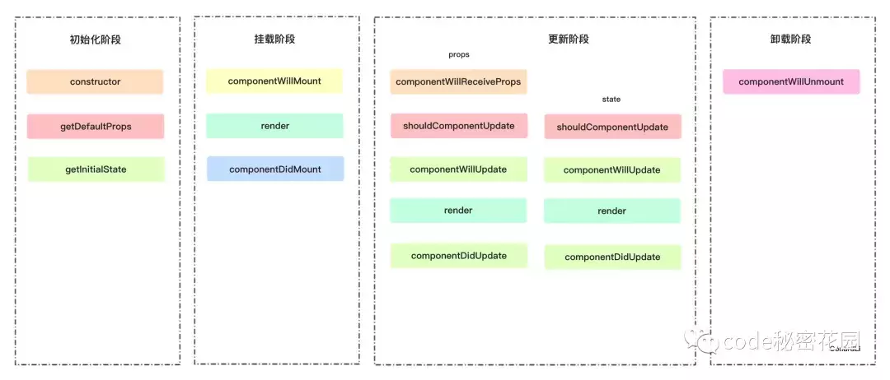
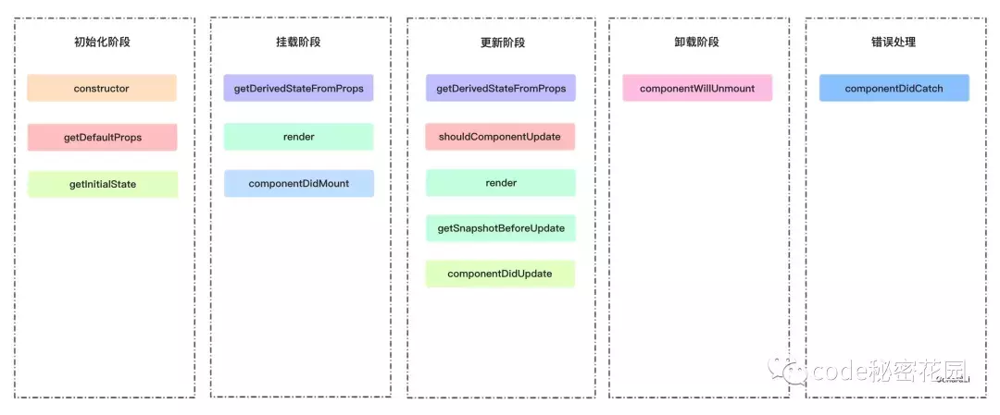

#### React生命周期有哪些，16版本生命周期发生了哪些变化？

1. react15的生命周期

+ 初始化阶段
   + constructor 构造函数
   + getDefaultProps props 默认值
   + getInitialState state 默认值
+ 挂载阶段
   + componentWillMount 组件初始化渲染前调用
   + render 组件渲染
   + componentDidMount 组件挂载到DOM后调入
+ 更新阶段
   + componentWillReceiveProps 组件将要接收新 props 前调用
   + shouldComponentUpdate 组件是否需要更新
   + componentWillUpdate 组件更新前调用
   + render 组件渲染
   + componentDidUpdate 组件更新后调用
+ 卸载阶段
   + componentWillUnmount 组件卸载前调用

2. react16的生命周期

+ 初始化阶段
   + constructor 构造函数
   + getDefaultProps props 默认值
   + getInitialState state 默认值
+ 挂载阶段
   + staticgetDerivedStateFromProps(props, state)
   + render
   + componentDidMount
   > getDerivedStateFromProps: 组件每次被rerender的时候，包括在组件构建之后（虚拟dom之后，实际dom挂载之前），每次获取新的props或state之后；每次接收新的props之后都会返回一个对象作为新的state，返回null则说明不需要更新state；配合componentDidUpdate，可以覆盖componentWillReceiveProps的所有用法。

+ 更新阶段
   + staticgetDerivedStateFromProps(props, state)
   + shouldComponentUpdate
   + render
   + getSnapShotBeforeUpdate(prevProps,prevState)
   + componentDidUpdate
   > getSnapshotBeforeUpdate: 触发时间: update发生的时候，在render之后，在组件dom渲染之前；返回一个值，作为 componentDidUpdate的第三个参数；配合componentDidUpdate，可以覆盖componentWillUpdate的所有方法。

+ 卸载阶段
   + componentWillUnmount
+ 错误处理阶段
   + componentDidCatch

React16新的生命周期弃用了 componentWillMount、componentWillReceiveProps，componentWillUpdate新增了 getDerivedStateFromProps、getSnapshotBeforeUpdate来代替弃用的三个钩子函数。
    > React16 并没有删除这三个钩子函数，但是不能和新增的钩子函数混用， React17将会删除这三个钩子函数，新增了对错误的处理（componentDidCatch)

作者：我真的好想学习啊
链接：https://juejin.im/post/5d89cbd26fb9a06b2005a597
来源：掘金
